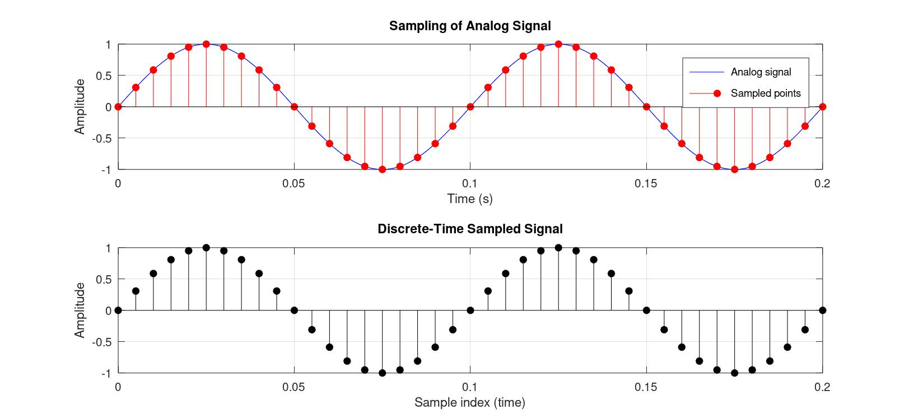
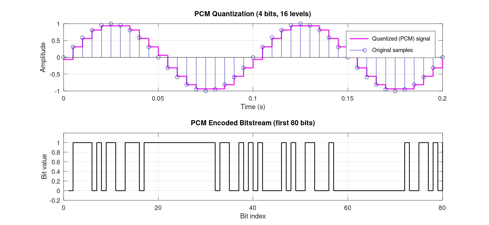
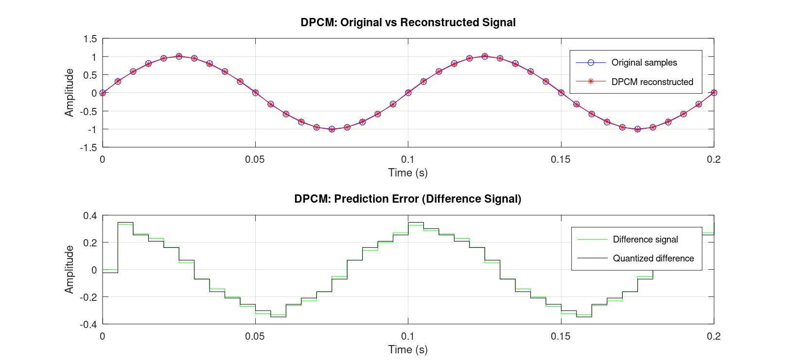
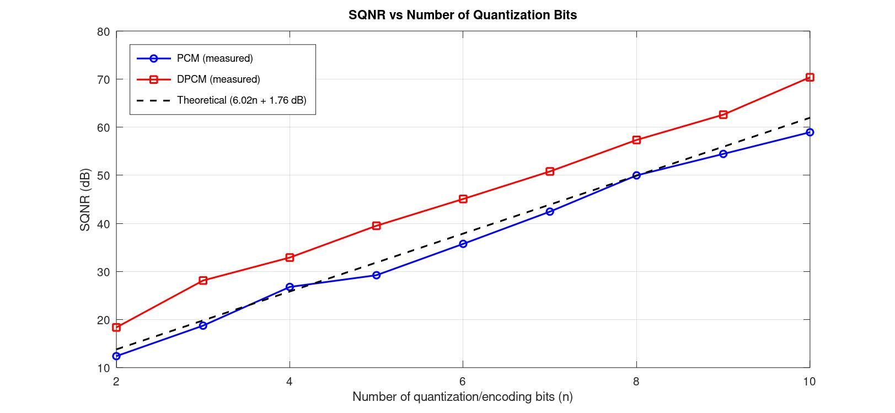

# Digital Communication — Sampling & Quantization (PCM / DPCM)

Simulation of **sampling and quantization** using **Pulse Code Modulation (PCM)** and **Differential Pulse Code Modulation (DPCM)**, implemented in **GNU Octave** (fully compatible with MATLAB).

The script models a complete baseband digital communication front-end:
analog message generation → sampling → uniform quantization → binary PCM encoding → differential (DPCM) encoding, with performance compared using **SQNR (Signal-to-Quantization-Noise Ratio)**.

---

## 📁 Repository Structure

```
Digital_Communication/
│
├── Quantization_PCM.m          # Main simulation script
├── Quantization_PCM_SQNR.m     # SQNR analysis script
│
└── Simulations/                # Output plots
    ├── Sampling.jpg
    ├── Quantization_PCM.jpg
    ├── DPCM.jpg
    └── SQNR.jpg
```

---

## ⚙️ Requirements

- **GNU Octave** (no extra packages required — `quantiz()` and `de2bi()` are re-implemented locally) **or**
- **MATLAB** with the Communications Toolbox (built-in `quantiz`/`de2bi` will also work)

Run with:
```bash
octave Quantization_PCM.m
```

---

## 🧠 Technical Documentation

### 1. Helper Functions

Since the script avoids dependency on the `communications` package, two utility functions replicate standard toolbox behavior:

| Function | Purpose |
|---|---|
| `my_quantiz(samples, partition, codebook)` | Maps each input sample to a quantization index and reconstruction level, based on user-defined decision boundaries (`partition`) and output levels (`codebook`) — equivalent to `quantiz()`. |
| `my_de2bi(dec_vals, n)` | Converts decimal quantizer indices into an `n`-bit binary matrix (MSB-first) — equivalent to `de2bi(x, n, 'left-msb')`. |

### 2. Message Signal Generation

A sinusoidal analog message is generated as the reference signal:

```
x(t) = Am · sin(2π·fm·t)
```

- `fm = 10 Hz` — message frequency
- `Am = 1` — amplitude
- Plotted at a high resolution (`Fs_cont = 10 kHz`) to visually represent a continuous-time signal.

### 3. Sampling

The message is sampled at `Fs = 200 Hz`, well above the Nyquist rate (`2·fm = 20 Hz`), ensuring alias-free reconstruction. The sampled points are overlaid on the continuous waveform to visualize the sampling process.

### 4. PCM Quantization

A **uniform mid-rise quantizer** with `n_bits = 4` (`L = 16` levels) is applied:

- Step size: `Δ = (Vmax − Vmin) / L`
- Decision boundaries (`partition`) and reconstruction levels (`codebook`) are computed symmetrically around zero.
- Each quantized sample's index is converted into a 4-bit binary codeword and concatenated into a serial **PCM bitstream**.

**Performance metric — SQNR:**
```
SQNR (dB) = 10·log10( signal_power / quantization_noise_power )
```
compared against the theoretical bound:
```
SQNR_theoretical ≈ 6.02·n + 1.76 dB
```

### 5. DPCM (Differential PCM)

Instead of quantizing the raw sample, DPCM quantizes the **prediction error**:

```
d(k) = x(k) − pred(k)
```

- **Predictor:** simple 1st-order predictor using the *previous reconstructed sample*, `pred(k) = x_recon(k−1)`.
- The difference signal `d(k)` typically has a smaller dynamic range than `x(k)`, so a quantizer scaled to `1.2×` the max sample-to-sample difference is used, giving finer resolution per bit.
- The signal is reconstructed at the "receiver" as `x_recon(k) = pred(k) + d_quant(k)`.

### 6. Comparison

Both schemes use the same number of bits per sample (`n_bits = 4`). Their quantization noise and resulting SQNR are computed and compared to demonstrate that **DPCM generally outperforms PCM for correlated (smoothly varying) signals**, since it exploits redundancy between adjacent samples.

---

## 📊 Results

### Sampling of the Analog Signal
The continuous message signal and its discrete-time samples at `Fs = 200 Hz`:



---

### PCM Quantization
4-bit uniform quantization of the sampled signal and the resulting serial PCM bitstream:



---

### DPCM: Prediction and Reconstruction
Original vs. DPCM-reconstructed signal, along with the prediction-error (difference) signal before and after quantization:



---

### SQNR Comparison
Measured vs. theoretical SQNR for PCM, and comparison against DPCM performance:



---

## 📈 Sample Console Output

```
--- PCM Results ---
Bits/sample     : 4
Levels          : 16
Step size (delta): 0.1250
Measured SQNR   : XX.XX dB
Theoretical SQNR: 25.84 dB

--- DPCM Results ---
Bits/sample (for difference signal): 4
Measured SQNR : XX.XX dB

--- Comparison ---
PCM  SQNR : XX.XX dB
DPCM SQNR : XX.XX dB
=> DPCM performs better for this correlated (sinusoidal) signal.
```

*(Exact dB values depend on the sample set generated at runtime.)*

---

## 🔑 Key Concepts Demonstrated

- Nyquist sampling and alias-free reconstruction
- Uniform mid-rise quantization
- Binary PCM encoding (decimal → bits, MSB-first)
- Differential encoding with a simple 1st-order predictor
- Quantization noise power and SQNR (measured vs. theoretical)
- Comparative performance of PCM vs. DPCM for correlated signals

---

## 📄 License

This project is intended for educational use in digital communication coursework and self-study.
