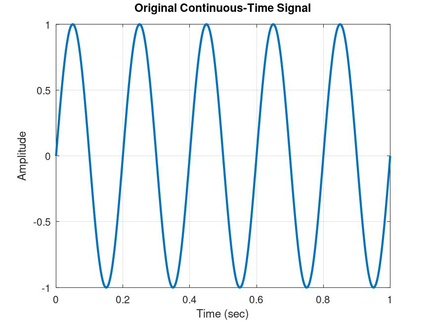
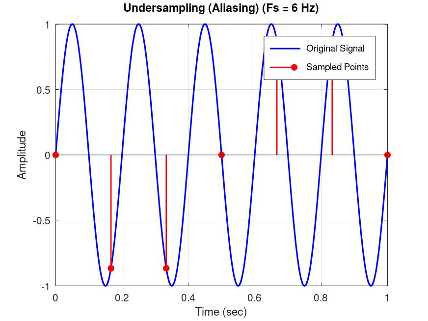
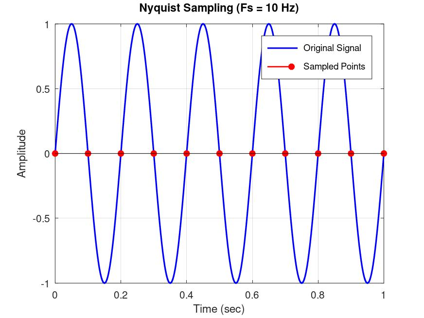
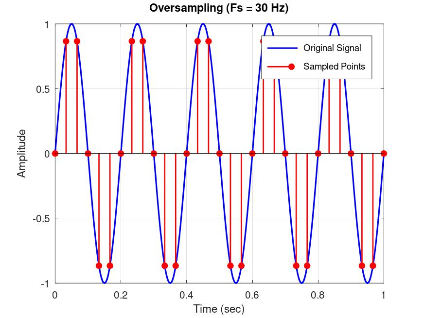
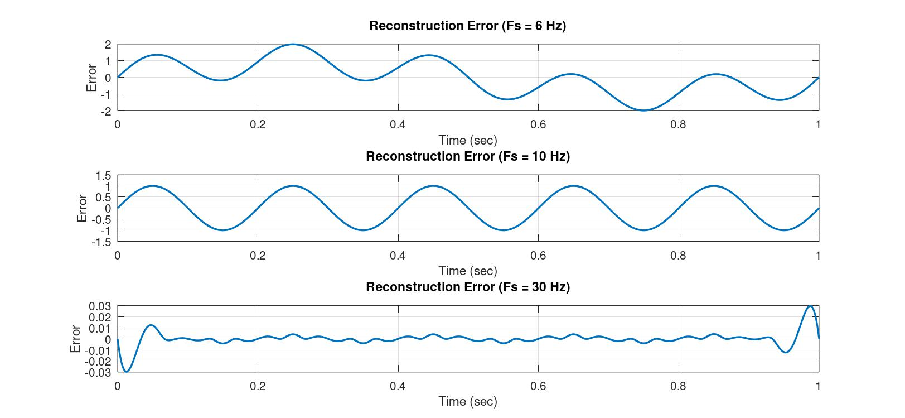
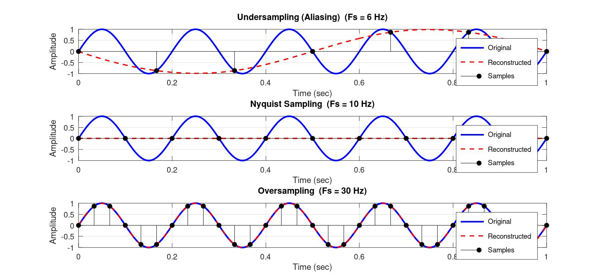

# Digital Communication — Sampling Theorem Demonstration

Simulation and verification of the **Nyquist–Shannon Sampling Theorem**, implemented in **GNU Octave** (fully compatible with MATLAB). A sinusoidal analog signal is sampled at three different rates — **below**, **at**, and **above** the Nyquist rate — to visually demonstrate aliasing, critical sampling, and oversampling, along with signal reconstruction and frequency-domain analysis.

---

## 📁 Repository Structure

```
Digital_Communication/
│
├── Sampling_0.m                 # Multi-figure version (one figure per plot type)
├── Sampling_1.m                 # Consolidated single-figure (grid/dashboard) version
│
└── Simulations/                 # Output plots
    ├── original_signal.jpg
    ├── under_sampling.jpg
    ├── nyquist_sampling.jpg
    ├── Over_sampling.jpg
    ├── reconstruction.jpg
    └── Sampling.jpg
```

---

## ⚙️ Requirements

- **GNU Octave** or **MATLAB** (no toolboxes required — uses only built-in `fft`, `interp1`, `stem`, `subplot`)

Run either script with:
```bash
octave Sampling_0.m
% or
octave Sampling_1.m
```

---

## 🧠 Technical Documentation

### 1. Signal Parameters

Both scripts generate a reference sinusoid:

```
x(t) = A · sin(2π·f_signal·t)
```

- `A = 1` — amplitude
- `f_signal = 5 Hz` — analog signal frequency
- `duration = 1 s`
- Time axis resolved at `dt = 0.0005 s` to approximate a continuous-time signal for plotting.

**Nyquist Rate:**
```
Fs_nyquist = 2 × f_signal = 10 Hz
```

### 2. Sampling Frequencies Tested

| Case | Fs (Hz) | Relation to Nyquist | Expected Behavior |
|---|---|---|---|
| Undersampling | 6 | Fs < 2·f_signal | Aliasing — reconstructed signal misrepresents the original frequency |
| Nyquist Sampling | 10 | Fs = 2·f_signal | Theoretical minimum rate; reconstruction is borderline/fragile |
| Oversampling | 30 | Fs > 2·f_signal | Accurate reconstruction, closely matches original |

For each rate, the sample instants are generated as `ts = 0:1/fs:duration` and sampled as `xs = A·sin(2π·f_signal·ts)`.

### 3. Signal Reconstruction

Sampled points are interpolated back to the fine time grid using **cubic spline interpolation**:
```matlab
xr = interp1(ts, xs, t, 'spline');
```
This approximates ideal low-pass (sinc) reconstruction well enough to visually illustrate the effect of each sampling rate, including aliasing distortion in the undersampled case.

### 4. Frequency-Domain Analysis

The **FFT magnitude spectrum** is computed for:
- The original continuous-time signal, and
- Each sampled signal (using its own `fs` for frequency-axis scaling: `freq = (0:N-1)*(fs/N)`)

This highlights how the spectral content of the undersampled signal folds/aliases into lower frequencies, while the oversampled case cleanly preserves the 5 Hz tone.

### 5. Reconstruction Error (`Sampling_0.m` only)

`Sampling_0.m` additionally computes and plots the **pointwise reconstruction error**:
```
error(t) = x(t) − x_reconstructed(t)
```
for each sampling case, quantifying how far the reconstructed waveform deviates from the true analog signal — largest for undersampling, negligible for oversampling.

### 6. Script Comparison

| Feature | `Sampling_0.m` | `Sampling_1.m` |
|---|---|---|
| Output layout | Separate figures (8 total: original signal, 3 sampled, reconstruction subplot, spectrum, sampled spectra, error) | Single consolidated dashboard figure (4×3 subplot grid) |
| Reconstruction error plot | ✅ Included (Figure 8) | ❌ Not included |
| Best for | Detailed, per-plot inspection | Compact side-by-side comparison across all 3 cases |

---

## 📊 Results

### Original Continuous-Time Signal
The 5 Hz analog reference sinusoid used as the basis for all sampling experiments:



---

### Undersampling (Fs = 6 Hz) — Aliasing
Sampling below the Nyquist rate causes the reconstructed signal to misrepresent the true 5 Hz tone as a lower "alias" frequency:



---

### Nyquist Sampling (Fs = 10 Hz)
Sampling exactly at the Nyquist rate — the theoretical minimum required to capture the signal without loss:



---

### Oversampling (Fs = 30 Hz)
Sampling well above the Nyquist rate closely preserves the original waveform shape:



---

### Signal Reconstruction Comparison
Spline-based reconstruction of the analog signal from samples, compared across all three sampling rates:



---

### Consolidated Sampling Dashboard
Combined view (from `Sampling_1.m`) showing original signal, sampled points, reconstruction, and spectrum for all three cases in one figure:



---

## 📈 Sample Console Output

```
Signal Frequency : 5.00 Hz
Nyquist Rate     : 10.00 Hz

Sampling Theorem Demonstration Completed Successfully.
```

---

## 🔑 Key Concepts Demonstrated

- Nyquist–Shannon Sampling Theorem and the Nyquist rate
- Aliasing due to undersampling
- Critical (Nyquist-rate) sampling behavior
- Faithful reconstruction via oversampling
- Signal reconstruction using spline interpolation
- Frequency-domain (FFT) analysis of sampled signals
- Quantifying reconstruction error across sampling regimes

---

## 📄 License

This project is intended for educational use in digital communication coursework and self-study.
